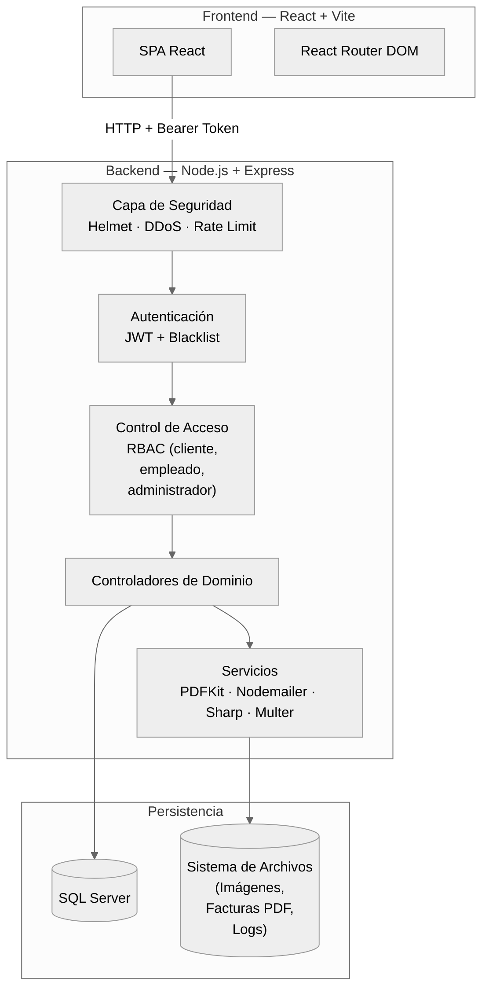
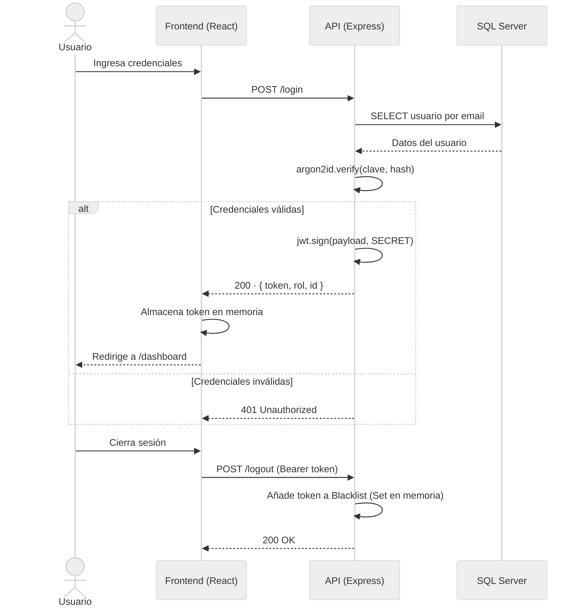
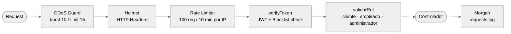
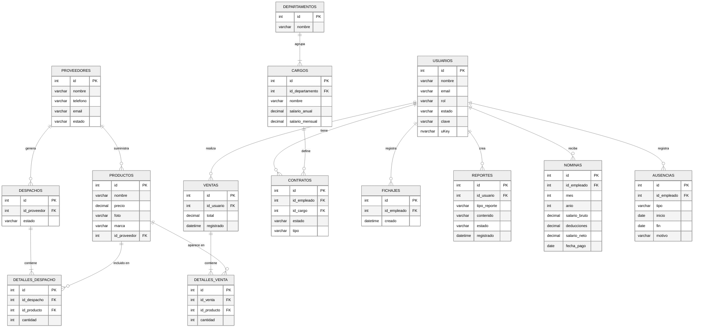

# Haonter ERP

Sistema de planificación de recursos empresariales con arquitectura desacoplada (SPA + REST API). Cubre la gestión operativa completa de una empresa: usuarios, inventario, ventas, despachos, facturación, contratos de empleados y control de asistencia, todo bajo un modelo de seguridad por capas.

---

## Arquitectura general



---

## Módulos del sistema

| Módulo | Descripción | Roles con acceso |
|---|---|---|
| **Usuarios** | CRUD completo, foto de perfil, recuperación de contraseña por correo | administrador, empleado |
| **Productos** | Gestión de inventario con carga de imágenes vía Multer + Sharp | administrador, empleado |
| **Proveedores** | Alta y seguimiento de proveedores | administrador, empleado |
| **Ventas** | Registro de ventas con detalle de línea por producto y paginación | administrador, empleado |
| **Despachos** | Trazabilidad de envíos con estados `pendiente / completo / cancelado` | administrador, empleado |
| **Facturas** | Generación de PDF con PDFKit y envío automático por correo | administrador, empleado |
| **Contratos** | Gestión de contratos de empleados con notificación por correo | administrador |
| **Fichajes** | Control de asistencia del personal | administrador, empleado |
| **Departamentos** | Estructura organizacional de la empresa | administrador |
| **Cargos** | Puestos de trabajo asociados a departamentos | administrador |
| **Reportes** | Generación de reportes del negocio | administrador, empleado |
| **Nóminas** | Cálculo y registro de nóminas mensuales *(en desarrollo)* | administrador |
| **Ausencias** | Control de vacaciones, licencias y permisos del personal *(en desarrollo)* | administrador |

---

## Flujo de autenticación



> **Sesión única por usuario — mecanismo `uKey`:** En cada login se genera una clave aleatoria (`uKey`) que se persiste en la columna `usuarios.uKey` de la base de datos y se incluye en el payload del JWT. Cada petición autenticada valida en tiempo real que el `uKey` del token coincide con el almacenado en DB. Un nuevo login desde cualquier dispositivo rota el `uKey`, invalidando automáticamente todas las sesiones activas anteriores sin necesidad de blacklist. Adicionalmente el blacklist cubre la invalidación inmediata en logout antes de que expire el token.

---

## Pipeline de seguridad por petición

Cada request entrante atraviesa las siguientes capas antes de llegar al controlador:



---

## Modelo de datos principal



---

## Stack tecnológico

### Frontend
| Tecnología | Rol |
|---|---|
| React 18 + Vite 6 | SPA con HMR y build optimizado |
| React Router DOM 7 | Enrutamiento client-side |
| Tailwind CSS 3 | Utilidades CSS, diseño responsivo |
| Axios | Cliente HTTP con interceptores |
| SweetAlert2 | Diálogos y confirmaciones de usuario |
| Atropos | Efecto parallax 3D en pantalla de login |
| React Icons / Lucide React | Sistema de iconografía |

### Backend
| Tecnología | Rol |
|---|---|
| Node.js + Express 4 | API REST, gestión de rutas y middlewares |
| SQL Server (mssql 11) | Persistencia relacional |
| JWT (jsonwebtoken) | Autenticación stateless con blacklist activa |
| Argon2id | Hash de contraseñas (64 MB RAM, 8 iteraciones, paralelismo 2) |
| Helmet | Hardening de cabeceras HTTP |
| express-rate-limit | Throttling por IP |
| ddos | Protección contra ráfagas de peticiones |
| Multer + Sharp | Recepción y procesamiento de imágenes |
| PDFKit | Generación de facturas en PDF |
| Nodemailer | Envío de correos (facturas, contratos, recovery) |
| Morgan | Logging persistente de peticiones HTTP |

---

## Estructura del repositorio

```
haonter-erp/              # Frontend React + Vite
│   src/
│   ├── pages/            # LoginRegister · Dashboard · Error404 · Error500
│   ├── components/       # Sidebar
│   └── assets/

haonter-erp-back/         # Backend Express
│   Controllers/          # Lógica de negocio por módulo
│   Routes/               # Definición de endpoints REST
│   Middlewares/           # Auth · RBAC · Upload · Multer error handler
│   utils/                # Validadores de dominio · generadores
│   database/             # dbConfig.js · schema SQL
│   Logs/                 # requests.log (Morgan)
│   Media/                # Uploads (productos · usuarios) · Facturas PDF
```

---

## Instalación y configuración

### 1. Clonar el repositorio

```bash
git clone https://github.com/haonter/Haonter-ERP.git
cd Haonter-ERP
```

### 2. Instalar dependencias

```bash
cd haonter-erp && npm install
cd ../haonter-erp-back && npm install
```

### 3. Base de datos

Crea la base de datos en SQL Server y ejecuta el schema:

```bash
sqlcmd -S localhost -i haonter-erp-back/database/database.sql
```

> [!TIP]
> Si no tienes `sqlcmd`, puedes usar **DBeaver**, **SQL Server Management Studio** o cualquier cliente SQL para ejecutar el script `database.sql` en tu instancia de SQL Server.

### 4. Variables de entorno

Crea `haonter-erp-back/.env`:

```env
DB_SERVER=<tu_servidor_sql>
DB_DATABASE=<tu_base_de_datos>
DB_USER=<tu_usuario>
DB_PASSWORD=<tu_contraseña>
DB_PORT=1433 <- Puerto por defecto de SQL Server
SERVER_PORT=7001 <- Puerto por defecto para la API
JWT_SECRET=<tu_secreto>
BASE_URL=http://localhost:7001/api/v1 <- Debe incluir el prefijo de versión
API_PREFIX=/api/v1 <- Prefijo de versión de la API (por defecto /api/v1)
```

### 5. Arrancar

```bash
# Terminal 1 — Backend
cd haonter-erp-back && npm start

# Terminal 2 — Frontend
cd haonter-erp && npm run dev
```

La API queda disponible en `http://localhost:7001` y el cliente en `http://localhost:5173`.

---

## API — Referencia de endpoints

> **Base URL:** `http://<host>:<SERVER_PORT>/api/v1`  (configurable via `API_PREFIX` en `.env`)
> Ejemplo local: `http://localhost:7000/api/v1`

Las rutas de esta sección son **relativas** a la base URL. Todos los endpoints requieren `Authorization: Bearer <token>` salvo los marcados con `—`. Los que soportan paginación aceptan `?page=&limit=` y responden con `total`, `pagina`, `totalPaginas`, `siguiente` y `anterior`.

### Formato de respuesta de error

Todos los errores comparten la misma estructura:

```json
{
  "codigo": 404,
  "mensaje": "No se encontró ningún usuario con ese ID"
}
```

| Campo | Tipo | Descripción |
|---|---|---|
| `codigo` | `number` | Código HTTP del error |
| `mensaje` | `string` | Descripción legible del problema |

> [!IMPORTANT]
> Códigos habituales: 
>   - `400` validación de campos
>   - `401` autenticación/token
>   - `403` sin permisos de rol
>   - `404` recurso no encontrado
>   - `500` error interno del servidor

---

### Autenticación

| Método | Ruta | Auth | Query params | Descripción |
|---|---|---|---|---|
| `POST` | `/login` | — | — | Autenticación; devuelve JWT |
| `POST` | `/logout` | JWT | — | Invalida el token (blacklist) |
| `POST` | `/register` | — | — | Registro público de usuario con foto opcional |
| `PATCH` | `/recovery/` | — | — | Genera nueva clave y la envía por correo |

---

### Usuarios

| Método | Ruta | Auth | Query params | Descripción |
|---|---|---|---|---|
| `GET` | `/usuarios` | JWT | `page`, `limit` | Lista paginada de todos los usuarios |
| `GET` | `/usuarios/id/` | JWT | `id` | Usuario por ID |
| `GET` | `/usuarios/rol/` | JWT | `rol`, `page`, `limit` | Usuarios filtrados por rol (`cliente`, `empleado`, `administrador`) |
| `GET` | `/usuarios/cedula/` | JWT | `cedula` | Usuario por cédula |
| `GET` | `/usuarios/estado/` | JWT | `estado`, `page`, `limit` | Usuarios por estado (`activo`, `inactivo`, `bloqueado`) |
| `GET` | `/usuarios/telefono/` | JWT | `telefono` | Usuario por teléfono |
| `GET` | `/usuarios/email/` | JWT | `email` | Usuario por email |
| `POST` | `/usuarios` | JWT | — | Crea usuario con foto opcional (multipart) |
| `PATCH` | `/usuarios/` | JWT | — | Edita datos del usuario con foto opcional |
| `PATCH` | `/usuarios/cambiar_clave/` | JWT | — | Cambia contraseña (requiere clave actual) |
| `DELETE` | `/usuarios/` | JWT | `id` | Elimina usuario (no si tiene contrato activo) |

---

### Productos

| Método | Ruta | Auth | Query params | Descripción |
|---|---|---|---|---|
| `GET` | `/productos` | JWT | `page`, `limit` | Lista paginada de productos |
| `GET` | `/productos/id/` | JWT | `id` | Producto por ID |
| `GET` | `/productos/nombre/` | JWT | `nombre`, `page`, `limit` | Productos por nombre (búsqueda parcial) |
| `GET` | `/productos/marca/` | JWT | `marca`, `page`, `limit` | Productos por marca |
| `GET` | `/productos/estado/` | JWT | `estado`, `page`, `limit` | Productos por estado |
| `GET` | `/productos/proveedor/` | JWT | `proveedor`, `page`, `limit` | Productos por proveedor |
| `POST` | `/productos` | JWT | — | Crea producto con imagen (multipart) |
| `PATCH` | `/productos/` | JWT | `id` | Edita datos del producto con imagen opcional |
| `PATCH` | `/productos/stock/` | JWT | `id` | Actualiza únicamente el stock |
| `DELETE` | `/productos/` | JWT | `id` | Elimina producto |

---

### Ventas

| Método | Ruta | Auth | Query params | Descripción |
|---|---|---|---|---|
| `GET` | `/ventas` | JWT | `page`, `limit` | Lista paginada; incluye detalle de productos por venta |
| `GET` | `/ventas/id/` | JWT | `id` | Venta por ID con detalle de productos |
| `GET` | `/ventas/usuario/` | JWT | `id_usuario`, `page`, `limit` | Ventas de un usuario |
| `GET` | `/ventas/fecha/` | JWT | `fecha`, `page`, `limit` | Ventas de una fecha exacta (`YYYY-MM-DD`) |
| `GET` | `/ventas/rango_fecha/` | JWT | `inicio`, `fin`, `page`, `limit` | Ventas en un rango de fechas |
| `POST` | `/ventas` | JWT | — | Registra venta con línea de detalle de productos |

---

### Proveedores

| Método | Ruta | Auth | Query params | Descripción |
|---|---|---|---|---|
| `GET` | `/proveedores` | JWT | `page`, `limit` | Lista paginada de proveedores |
| `GET` | `/proveedores/id/` | JWT | `id` | Proveedor por ID |
| `GET` | `/proveedores/nombre/` | JWT | `nombre`, `page`, `limit` | Proveedores por nombre (búsqueda parcial) |
| `GET` | `/proveedores/telefono/` | JWT | `telefono` | Proveedor por teléfono |
| `GET` | `/proveedores/email/` | JWT | `email` | Proveedor por email |
| `GET` | `/proveedores/contratado/` | JWT | `fecha`, `page`, `limit` | Proveedores por fecha de contratación |
| `GET` | `/proveedores/estado/` | JWT | `estado`, `page`, `limit` | Proveedores por estado |
| `POST` | `/proveedores` | JWT | — | Crea proveedor |
| `PATCH` | `/proveedores/` | JWT | `id` | Edita proveedor |
| `DELETE` | `/proveedores/` | JWT | `id` | Elimina proveedor |

---

### Despachos

| Método | Ruta | Auth | Query params | Descripción |
|---|---|---|---|---|
| `GET` | `/despachos` | JWT | `estado` (opcional), `page`, `limit` | Lista paginada; filtro de estado opcional (`pendiente`, `completo`, `cancelado`) |
| `GET` | `/despachos/id/` | JWT | `id` | Despacho por ID |
| `GET` | `/despachos/fecha/` | JWT | `fecha`, `estado` (opcional), `page`, `limit` | Despachos de una fecha con estado opcional |
| `GET` | `/despachos/estado/` | JWT | `estado`, `page`, `limit` | Despachos por estado |
| `GET` | `/despachos/rango_fecha/` | JWT | `inicio`, `fin`, `page`, `limit` | Despachos en un rango de fechas |
| `GET` | `/despachos/proveedor/id/` | JWT | `id` | Despachos de un proveedor por su ID |
| `GET` | `/despachos/proveedor/nombre/` | JWT | `nombre`, `page`, `limit` | Despachos de proveedores por nombre |
| `POST` | `/despachos` | JWT | — | Crea despacho |
| `PATCH` | `/despachos/` | JWT | `id` | Edita despacho |
| `DELETE` | `/despachos/` | JWT | `id` | Elimina despacho |

---

### Reportes

| Método | Ruta | Auth | Query params | Descripción |
|---|---|---|---|---|
| `GET` | `/reportes` | JWT | `page`, `limit` | Lista paginada de reportes |
| `GET` | `/reportes/id/` | JWT | `id` | Reporte por ID |
| `GET` | `/reportes/tipo/` | JWT | `tipo`, `page`, `limit` | Reportes por tipo |
| `GET` | `/reportes/estado/` | JWT | `estado`, `page`, `limit` | Reportes por estado |
| `GET` | `/reportes/usuario/` | JWT | `id_usuario`, `page`, `limit` | Reportes de un usuario |
| `GET` | `/reportes/fecha/` | JWT | `fecha`, `page`, `limit` | Reportes de una fecha exacta |
| `GET` | `/reportes/rango_fecha/` | JWT | `inicio`, `fin`, `page`, `limit` | Reportes en un rango de fechas |
| `POST` | `/reportes` | JWT | — | Crea reporte |
| `PATCH` | `/reportes/` | JWT | `id` | Edita estado del reporte |
| `DELETE` | `/reportes/` | JWT | `id` | Elimina reporte por ID |
| `DELETE` | `/reportes/usuario/` | JWT | `id_usuario` | Elimina todos los reportes de un usuario |
| `DELETE` | `/reportes/estado/` | JWT | `estado` | Elimina reportes por estado |

---

### Contratos

| Método | Ruta | Auth | Query params | Descripción |
|---|---|---|---|---|
| `GET` | `/contratos` | JWT | `page`, `limit` | Lista paginada de contratos |
| `GET` | `/contratos/id` | JWT | `id` | Contrato por ID |
| `GET` | `/contratos/usuario` | JWT | `id_usuario`, `page`, `limit` | Contratos de un usuario |
| `GET` | `/contratos/registrado` | JWT | `fecha`, `page`, `limit` | Contratos por fecha de registro |
| `GET` | `/contratos/inicio` | JWT | `fecha`, `page`, `limit` | Contratos por fecha de inicio |
| `GET` | `/contratos/fin` | JWT | `fecha`, `page`, `limit` | Contratos por fecha de fin |
| `GET` | `/contratos/fechas` | JWT | `inicio`, `fin`, `page`, `limit` | Contratos por rango de fechas de inicio y fin |
| `GET` | `/contratos/estado` | JWT | `estado`, `page`, `limit` | Contratos por estado |
| `GET` | `/contratos/tipo` | JWT | `tipo`, `page`, `limit` | Contratos por tipo |
| `POST` | `/contratos` | JWT | — | Crea contrato y notifica por correo |
| `PATCH` | `/contratos/` | JWT | `id` | Edita estado del contrato |
| `DELETE` | `/contratos/` | JWT | `id` | Elimina contrato (no si está asociado a usuario activo) |

---

### Departamentos

| Método | Ruta | Auth | Query params | Descripción |
|---|---|---|---|---|
| `GET` | `/departamentos` | JWT | `page`, `limit` | Lista paginada de departamentos |
| `GET` | `/departamentos/cargos` | JWT | `page`, `limit` | Departamentos con sus cargos incluidos |
| `GET` | `/departamentos/id` | JWT | `id` | Departamento por ID |
| `GET` | `/departamentos/nombre` | JWT | `nombre`, `page`, `limit` | Departamentos por nombre |
| `POST` | `/departamentos` | JWT | — | Crea departamento |
| `PATCH` | `/departamentos/` | JWT | `id` | Edita departamento |
| `DELETE` | `/departamentos/` | JWT | `id` | Elimina departamento (no si tiene cargos activos) |

---

### Cargos

| Método | Ruta | Auth | Query params | Descripción |
|---|---|---|---|---|
| `GET` | `/cargos` | JWT | `page`, `limit` | Lista paginada de cargos |
| `GET` | `/cargos/id` | JWT | `id` | Cargo por ID |
| `GET` | `/cargos/departamento` | JWT | `id_departamento`, `page`, `limit` | Cargos de un departamento |
| `GET` | `/cargos/nombre` | JWT | `nombre`, `page`, `limit` | Cargos por nombre |
| `GET` | `/cargos/salario` | JWT | `tipo` (`anual`\|`mensual`), `min`, `max`, `page`, `limit` | Cargos por rango salarial |
| `GET` | `/cargos/pagas` | JWT | `pagas`, `page`, `limit` | Cargos por número de pagas |
| `GET` | `/cargos/bono` | JWT | `bono`, `page`, `limit` | Cargos por bono |
| `POST` | `/cargos` | JWT | — | Crea cargo |
| `PATCH` | `/cargos/` | JWT | `id` | Edita cargo |
| `DELETE` | `/cargos/` | JWT | `id` | Elimina cargo |

---

### Fichajes

| Método | Ruta | Auth | Query params | Descripción |
|---|---|---|---|---|
| `GET` | `/fichajes/` | JWT | `page`, `limit` | Lista paginada de fichajes |
| `POST` | `/fichajes/` | JWT | — | Registra fichaje de entrada/salida |

---

### Facturas

| Método | Ruta | Auth | Query params | Descripción |
|---|---|---|---|---|
| `POST` | `/facturas/` | JWT | — | Genera factura en PDF; devuelve nombre del archivo |
| `POST` | `/facturas/enviar` | JWT | `destino` (email) | Genera factura PDF y la envía por correo al destinatario |

---

## Deuda técnica conocida

| # | Limitación | Impacto | Mitigación programada |
|---|---|---|---|
| 1 | Sin suite de tests automatizados | Regresiones silenciosas sin cobertura de CI/CD | Implementar Jest (unitarios) + Supertest (integración de endpoints) |
| 2 | Módulos **Nóminas** y **Ausencias** definidos en el schema pero sin controladores | Área de RRHH incompleta en backend | Implementación pendiente |
| 3 | `JWT_SECRET` débil en entornos de producción | Tokens predecibles o firmables por atacantes si el secreto es corto | Generar mínimo 256 bits de entropía aleatoria: `openssl rand -hex 32` |

---

## Equipo

| Nombre | Rol | GitHub |
|---|---|---|
| **Diego Rodriguez** | Backend · Frontend · UI/UX | [Didacusdev](https://github.com/Didacusdev) |
| **Guillermo Arismendi** | Frontend · UI/UX | [david-guillermo](https://github.com/david-guillermo) |

**Contacto:** [contacto@diegorodriguez.dev](mailto:contacto@diegorodriguez.dev)
